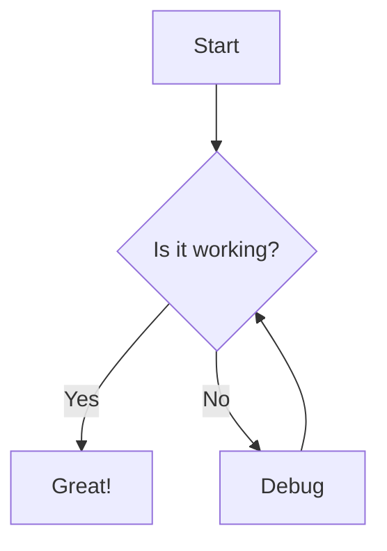
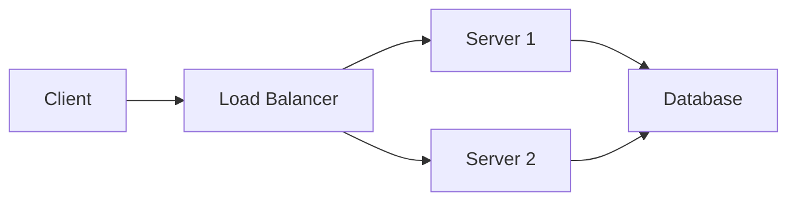

# 📝 Markdown Converter

A powerful web-based application that converts Markdown (.md) files to PDF, HTML, or DOCX formats with automatic Mermaid diagram rendering.

## ✨ Features

- **Multiple Output Formats**: Convert Markdown to PDF, HTML, or DOCX
- **Mermaid Diagram Support**: Automatically detects and renders Mermaid UML diagrams
  - HTML: Dynamic client-side rendering with Mermaid.js
  - PDF/DOCX: Diagrams converted to embedded images
- **Format Preservation**: Maintains original Markdown formatting, including:
  - Headings
  - Lists (ordered and unordered)
  - Code blocks
  - Tables
  - Blockquotes
  - Images
  - Links
- **Responsive UI**: Modern, intuitive interface that works on all devices
- **Drag & Drop**: Easy file upload with drag-and-drop support

## 🚀 Getting Started

### Prerequisites

- Node.js (v14 or higher)
- npm or yarn

### Installation

1. Clone or download this repository:
```bash
cd md_converter
```

2. Install dependencies:
```bash
npm install
```

3. Build CSS (first time only):
```powershell
npm run build:css
```

4. Start the server:
```bash
npm start
```

4. Open your browser and navigate to:
```
http://localhost:3000
```

### For Development

If you want to run with auto-reload during development (server + Tailwind CSS watcher):

```bash
npm run dev
```

This runs two processes:
- Tailwind CSS watcher that builds `public/tailwind.css` from `src/styles.css`
- Nodemon to restart the server on changes to `server.js`, `public/**/*.html`, `public/**/*.js`

Notes:
- The app now uses a locally built Tailwind stylesheet (`public/tailwind.css`) instead of the CDN in `public/index.html`.
- If styles ever look stale, rebuild once with `npm run build:css`.

## 📖 Usage

1. **Upload a Markdown File**:
   - Drag and drop a `.md` file onto the upload area, or
   - Click the upload area to browse and select a file

2. **Select Output Format**:
   - Choose between PDF, HTML, or DOCX

3. **Convert**:
   - Click the "Convert File" button
   - The converted file will be automatically downloaded

## 🎨 Mermaid Diagram Support

The application automatically detects Mermaid code blocks in your Markdown files:

````markdown

````

### Supported Mermaid Diagram Types

- Flowcharts
- Sequence Diagrams
- Class Diagrams
- State Diagrams
- Entity Relationship Diagrams
- User Journey Diagrams
- Gantt Charts
- Pie Charts
- And more!

## 📁 Project Structure

```
md_converter/
├── public/
│   ├── index.html      # Frontend UI
│   ├── styles.css      # Styling
│   └── app.js          # Frontend JavaScript
├── uploads/            # Temporary upload directory (auto-created)
├── server.js           # Express server and conversion logic
├── package.json        # Dependencies and scripts
└── README.md          # This file
```

## 🔧 Technology Stack

### Backend
- **Express**: Web server framework
- **Multer**: File upload handling
- **Marked**: Markdown to HTML conversion
- **Puppeteer**: PDF generation and Mermaid rendering
- **Mermaid**: Diagram rendering
- **html-to-docx**: DOCX generation
- **JSDOM**: HTML parsing

### Frontend
- **Vanilla JavaScript**: No frameworks, lightweight and fast
- **Modern CSS**: Responsive design with CSS Grid and Flexbox
- **Mermaid.js**: Client-side diagram rendering for HTML output

## 🎯 API Endpoints

### POST `/convert`
Converts uploaded Markdown file to specified format.

**Request:**
- Method: POST
- Content-Type: multipart/form-data
- Body:
  - `markdown`: File (required) - The .md file to convert
  - `format`: String (required) - Output format: "html", "pdf", or "docx"

**Response:**
- Success: Returns the converted file as a download
- Error: JSON object with error message

### GET `/health`
Health check endpoint.

**Response:**
```json
{
  "status": "ok"
}
```

## 📝 Example Markdown File

Create a test file `example.md`:

````markdown
# My Project Documentation

## Introduction
This is a sample Markdown document with a Mermaid diagram.

## Architecture Diagram



## Features
- Feature 1
- Feature 2
- Feature 3

## Code Example

```javascript
function hello() {
  console.log("Hello, World!");
}
```

## Table

| Column 1 | Column 2 | Column 3 |
|----------|----------|----------|
| Data 1   | Data 2   | Data 3   |
| Data 4   | Data 5   | Data 6   |
````

## 🐛 Troubleshooting

### Puppeteer Installation Issues

If you encounter issues installing Puppeteer on Windows, try:

```bash
npm install --legacy-peer-deps
```

Or set the Puppeteer download host:

```bash
set PUPPETEER_DOWNLOAD_HOST=https://registry.npmmirror.com/-/binary/chromium-browser-snapshots
npm install
```

### Port Already in Use

If port 3000 is already in use, you can change it by setting the PORT environment variable:

```bash
set PORT=4000
npm start
```

### Mermaid Rendering Issues

If Mermaid diagrams don't render properly:
- Ensure your Mermaid syntax is correct
- Check the browser console for errors
- Try a simpler diagram first to verify the setup

## 🔒 Security Notes

- The application stores uploaded files temporarily in the `uploads/` directory
- Files are automatically deleted after conversion
- Only `.md` files are accepted for upload
- Consider adding file size limits for production use

## 🚀 Production Deployment

For production deployment, consider:

1. Adding environment variable configuration
2. Implementing rate limiting
3. Adding authentication if needed
4. Using a reverse proxy (nginx)
5. Setting up proper logging
6. Adding file size limits
7. Implementing cleanup for orphaned upload files

## 📄 License

MIT License - Feel free to use this project for personal or commercial purposes.

## 🤝 Contributing

Contributions are welcome! Feel free to submit issues or pull requests.

## 💡 Future Enhancements

- [ ] Batch conversion support
- [ ] Custom styling options
- [ ] Template selection
- [ ] Cloud storage integration
- [ ] API key authentication
- [ ] Progress tracking for large files
- [ ] Preview before download
- [ ] Support for more diagram types

## 📧 Support

For issues or questions, please open an issue on the repository.
