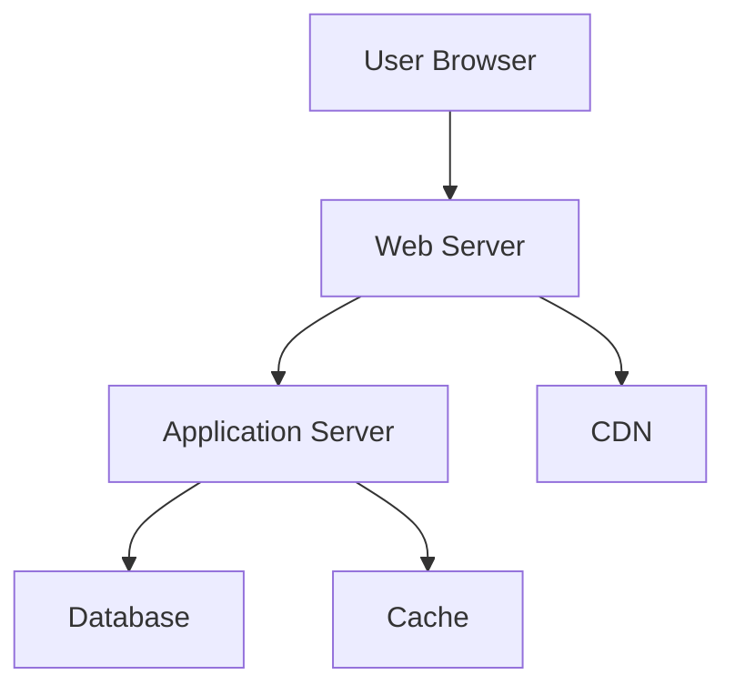
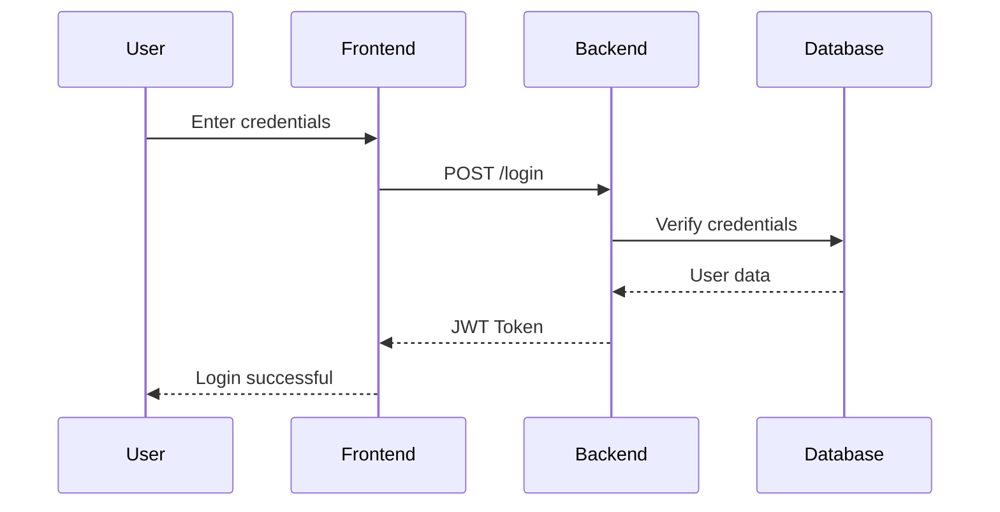
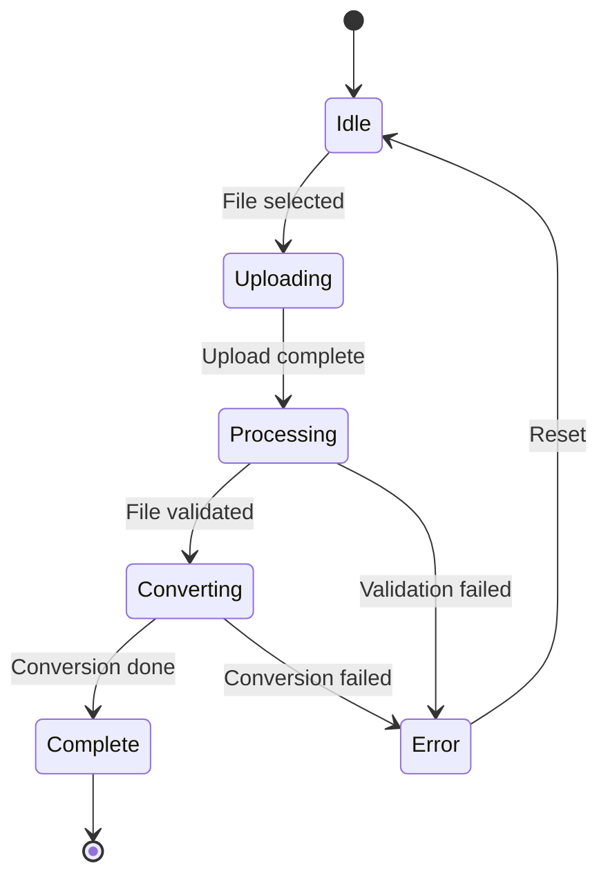
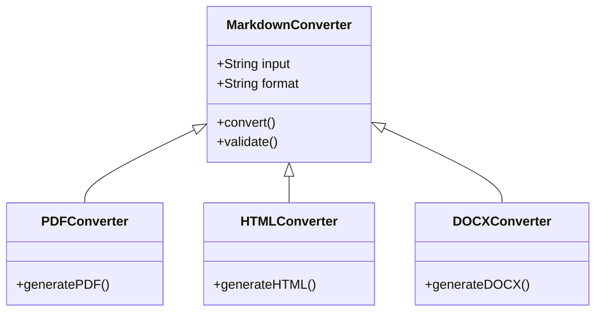

# Sample Markdown Document

## Introduction

This is a sample Markdown document that demonstrates various features including **Mermaid diagrams**, code blocks, tables, and more.

## System Architecture

Below is a simple architecture diagram:



## Process Flow

Here's a sequence diagram showing the user authentication process:



## Features

### Core Features
- ✅ Markdown to PDF conversion
- ✅ Markdown to HTML conversion
- ✅ Markdown to DOCX conversion
- ✅ Mermaid diagram rendering
- ✅ Responsive design

### Technical Features
1. Express.js server
2. Puppeteer for PDF generation
3. Mermaid.js integration
4. File upload handling
5. Drag and drop support

## Code Examples

### JavaScript Example

```javascript
function convertMarkdown(content, format) {
  if (format === 'pdf') {
    return generatePDF(content);
  } else if (format === 'html') {
    return generateHTML(content);
  } else if (format === 'docx') {
    return generateDOCX(content);
  }
}
```

### Python Example

```python
def process_markdown(file_path):
    with open(file_path, 'r') as f:
        content = f.read()
    return convert_to_html(content)
```

## Data Comparison

| Format | File Size | Quality | Compatibility |
|--------|-----------|---------|---------------|
| PDF    | Medium    | High    | Excellent     |
| HTML   | Small     | High    | Good          |
| DOCX   | Large     | Medium  | Excellent     |

## State Machine



## Class Diagram



## Important Notes

> **Note**: This application requires Node.js v14 or higher to run properly.

> **Warning**: Large files with many diagrams may take longer to process.

> **Tip**: Use the HTML format for the fastest conversion and best diagram interactivity.

## Blockquotes

As the documentation states:

> Markdown is a lightweight markup language with plain-text formatting syntax. 
> It is designed so that it can be converted to HTML and many other formats 
> using a tool by the same name.

## Lists

### Unordered List
- First item
- Second item
  - Nested item 1
  - Nested item 2
- Third item

### Ordered List
1. Install Node.js
2. Clone the repository
3. Install dependencies
   1. Run `npm install`
   2. Wait for completion
4. Start the server

## Links and Images

Visit [GitHub](https://github.com) for more information.

## Horizontal Rule

---

## Conclusion

This sample demonstrates the capabilities of the Markdown converter. All formatting, including Mermaid diagrams, will be preserved in the output format you choose.

**Happy Converting!** 🚀
